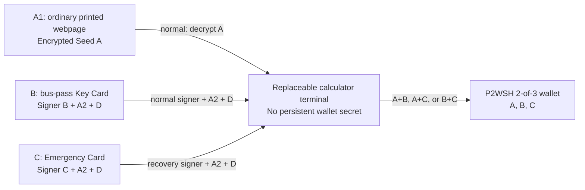

# QuietKey Core Architecture v1

**Status:** normative architecture proposal; implementation and target evidence remain stop-ship  
**Date:** 18 August 2026  
**Scope:** seed generation, PSBT import/review/sign/export, card storage, cloaked recovery, and recovery tooling  
**Reviewed inputs:** current QuietKey/Claude dossier (index plus Documents 00–08), Ian Coleman BIP39 Tool, SeedSigner, and COLDCARD firmware

## Executive decision

QuietKey should be built as a small, stateless, single-purpose Bitcoin signer around one fixed wallet policy:

```text
native P2WSH 2-of-3: wsh(sortedmulti(2,A,B,C))
derivation:          m/48'/0'/0'/2'/{0,1}/*
mnemonic profile:    BIP39 English, 24 words, 256-bit entropy, empty passphrase
PSBT profile:        PSBT v0, binary on SD, BBQr for QR
production network:  Bitcoin mainnet only
normal pair:         A1 + B
recovery pairs:      A1 + C, or B + C
```

The physical system is:

- **A1 — Recovery Document:** an ordinary printed webpage. Its useful body is a recipe, guitar tab, travel page, or similar decoy. A source-URL-looking footer contains error-corrected authenticated ciphertext of Seed A.
- **A2 — document key:** a fresh 256-bit key created during provisioning. It is copied to both bearer cards, then removed from the terminal.
- **B — Key Card:** a bus-pass-like bearer card containing signer B, A2, and the wallet descriptor/policy.
- **C — Emergency Card:** a second bearer card containing independent signer C, the same A2, and the same wallet descriptor/policy. Packaging and instructions vary by kit tier; the cryptography does not.
- **Terminal:** a replaceable, calculator-disguised air-gapped device. It retains no wallet secret between sessions.

This resolves the old Card-loss/Vault-Key blocker. No single custody object can spend. Every single custody object may be lost while one valid pair remains. A2 is no longer a primary-card single point of failure.

The architecture is selected, but it is not yet safe to fund. Card capability, production entropy reachability, A1 print/capture performance, QR performance on the fixed mechanics, parser hardening, power-failure behavior, reproducible builds, and real recovery rehearsals remain stop-ship gates.

Two claims must be avoided:

1. **“Fool-proof” is not an attainable security property.** QuietKey can be mistake-resistant, bounded, fail-closed, and independently verifiable. It cannot guarantee the absence of implementation defects.
2. **The 2-of-3 structure is storage and recovery resilience, not two-device authorization.** A malicious QuietKey terminal used in an A1+B session can see Seed A/A2 and can request B signatures. The booted terminal, its trusted display path, and its firmware are one authorization trust domain.

## 1. Review basis and important qualification

The repository analysis was pinned so later upstream changes cannot silently alter this review:

| Project | Reviewed commit | Relevant role | License consequence |
|---|---|---|---|
| Ian Coleman BIP39 | [`de71c223`](https://github.com/iancoleman/bip39/tree/de71c22328b24e0848bbe1bd12ac8974ca83b5b8) | BIP39 mechanics, entropy interpretation, offline vectors | MIT; reusable with attribution, though the browser tool should not become QuietKey's core |
| SeedSigner | [`5088588d`](https://github.com/SeedSigner/seedsigner/tree/5088588dd4f913a489329d2422b0f925ed281856) | stateless workflow, QR state machine, transaction-review UX | MIT; patterns and selected components may be reused after dependency review |
| COLDCARD firmware | [`55f93844`](https://github.com/Coldcard/firmware/tree/55f93844b56e3637468321e1c68638a8138a3a2b) | bounded PSBT handling, microSD lifecycle, fault handling | MIT plus Commons Clause; source-available, but not suitable for copying into a commercially sold QuietKey without separate licensing |

The COLDCARD licensing point is material. QuietKey should use a documented clean-room implementation of the learned protocol and safety patterns. It should not copy COLDCARD code and then describe the resulting product as unrestricted open source.

The current Claude dossier has substantially improved. It now correctly recognizes A1, A2 on both cards, native 2-of-3, 24-word seeds, no card PIN, both transports, descriptor sensitivity, and the remaining engineering blockers. Its useful reference constructions should remain test inputs. They must not be mistaken for a production architecture or proof.

## 2. Security goals and limits

### 2.1 What QuietKey must protect against

- Loss or theft of any one of A1, B, or C.
- Loss, destruction, or replacement of the terminal.
- A malicious or malformed PSBT supplied over QR or microSD.
- QR frame floods, format confusion, oversized data, and parser resource exhaustion.
- Incorrect UTXO amounts, fake change, malicious derivation metadata, unsafe sighashes, and transaction substitution after approval.
- Failure or silent bypass of one entropy source.
- Power loss during card provisioning or SD export.
- Accidental seed persistence in files, logs, swap, crash dumps, heap copies, or UI buffers.
- Ordinary print damage and OCR uncertainty in A1.
- Long-term recovery without a vendor account, network service, remembered PIN, or the original terminal.
- Reasonably foreseeable user mistakes: wrong card, wrong document, wrong network, incomplete review, accidental overwrite, and ambiguous entropy entry.

### 2.2 What the design does not honestly solve

- Theft or coercive use of any valid pair.
- A malicious terminal or malicious firmware during provisioning or signing.
- An invasive attack that extracts secrets from a bearer card.
- Physical replacement of the boot image where the existing hardware cannot provide an immutable root of trust.
- Side-channel resistance beyond what is actually measured on the selected card and SoC.
- A cryptographically relevant quantum computer. QuietKey can reduce key exposure and provide a migration path; it cannot invent a post-quantum Bitcoin spend condition before Bitcoin adopts one.
- User privacy after the user deliberately exports a full watch-only descriptor to an online coordinator.

### 2.3 Core invariant

The central product invariant is:

> Outside an active, physically authorized session, the terminal contains no wallet secret; possession of one custody object is insufficient to spend; every byte received from QR or SD is hostile until the core has bounded, parsed, and validated it.

## 3. Architecture blueprint

### 3.1 Custody and recovery topology



The normal path is intentionally hierarchical without changing the threshold:

- **Routine:** A1+B.
- **B unavailable:** A1+C.
- **A1 unavailable:** B+C, bypassing A entirely.
- **Terminal unavailable:** use another verified QuietKey terminal or the open rescue implementation.

Any loss or suspected compromise of A1, B, or C triggers one simple rule: use a surviving pair once, create a completely fresh A′/B′/C′/A2′/D′ wallet, and sweep all funds. A missing signing factor cannot simply be “reissued”; replacing any key changes the descriptor and therefore changes the funded wallet.

### 3.2 Software privilege architecture

The logical “core versus shell” split is useful for testing, but it is not enough if both live in one process. QuietKey should use three processes:

1. **`qk-core` — trusted wallet process**
   - Owns the keypad and framebuffer exclusively during wallet mode.
   - Owns card sessions and all secret memory.
   - Parses and validates hostile PSBT bytes.
   - Creates the exact transaction review shown on screen.
   - Reads the final physical approval directly.
   - Signs, verifies, finalizes, and returns non-secret output bytes.

2. **`qk-io` — unprivileged transport broker**
   - Reads a selected SD file or camera frame stream.
   - Enforces a first outer size/time/frame cap.
   - Passes immutable bytes to `qk-core` over a minimal local IPC protocol.
   - Writes only a core-provided result to a new output object.
   - Has no card access, no keypad access during approval, and no secret API.

3. **`qk-decoy` — calculator application**
   - Runs when no wallet session is active.
   - Has no wallet/card APIs and no wallet state.
   - Is terminated before `qk-core` takes exclusive control of the display, keypad, and card slot.

The Linux kernel, booted image, and physical display/keypad path remain trusted. Process isolation limits accidental and low-privilege compromise; it does not turn a compromised kernel into a safe platform.

### 3.3 Core language and cryptographic boundary

Use **Rust for the new core, parsers, state machines, recovery codec, and transport decoding**, provided the exact ARMv6/Linux target toolchain passes Gate C. Use a narrow, pinned C FFI only for Bitcoin Core's `libsecp256k1`.

Reasons:

- PSBT, descriptors, QR reassembly, OCR metadata, and APDUs are hostile-input parsers. Memory safety is a direct security property.
- Rust makes ownership and explicit lifetimes easier to audit than a pointer-heavy all-C design.
- Secret zeroization still requires deliberate engineering; Rust does not magically erase copies.
- `libsecp256k1` supplies a mature constant-time secp256k1 implementation and signature normalization/verification.

If target measurements rule Rust out, the fallback is a written decision record for an all-C core with checked arithmetic, fixed arenas, whole-program fuzzing, ASan/UBSan host builds, static analysis, compiler hardening, and a formal memory budget. Python and JavaScript are not acceptable for the production secret boundary.

### 3.4 Repository layout

```text
quietkey/
  core/                 Rust: entropy, BIP39/32, descriptors, A1, PSBT, policy, review
  secp/                 pinned libsecp256k1 + minimal reviewed FFI
  applet/               card applet and APDU specification
  platform/             trusted framebuffer/keypad/card adapters
  io-broker/            camera and SD broker; no secrets
  decoy/                calculator application
  rescue/               open CCID/ISO-7816 recovery CLI and reproducible rescue image
  simulator/            host simulator with mock cards, keypad, display, camera, SD
  fixtures/             normative vectors and hostile corpora
  fuzz/                 PSBT, descriptor, BBQr, A1, APDU, and state-machine targets
  docs/                  threat model, protocol specs, recovery runbooks, SBOM
  third_party/           pinned dependencies and licenses
```

No experiment belongs on the production build path. CloakGrid, anti-exfil signing, alternate QR formats, Taproot vault policy, miniscript timelocks, and speculative post-quantum formats remain outside `core/` until separately approved.

### 3.5 Secret-memory rules

- Disable swap, hibernation, core dumps, crash uploads, shell history, and wallet-session logging.
- Use fixed-size secret types for 32-byte entropy, A2, BIP39 seed output, and extended private keys.
- Page-lock secret arenas and mark them non-dumpable.
- Avoid heap allocation in entropy conditioning, mnemonic derivation, A1 decryption, and signing.
- Pass mutable references; do not return secret-bearing strings or generic byte vectors.
- Zeroize on success, error, cancel, timeout, card removal, transport failure, and process termination.
- Place a compiler barrier behind erasure and inspect release assembly for critical wrappers.
- Never render, serialize, log, or QR-export a mnemonic. Seed A exists as 32-byte entropy internally; B/C mnemonic material never leaves provisioning memory.
- Wipe framebuffer regions, camera/DMA buffers, parser arenas, and IPC buffers at session end.
- Treat `None`, garbage collection, `free()`, and ordinary object destruction as insufficient evidence of erasure.

### 3.6 Boot and update posture

- Boot directly into the signed, read-only appliance image; no desktop or general shell.
- Remove network, Bluetooth, Wi-Fi, and unnecessary USB data drivers from the production image.
- Publish reproducible release builds, hashes, SBOMs, toolchain versions, and signed offline update packages.
- Use dual update slots with read-back verification and power-loss recovery.
- Enforce rollback protection only if the hardware supplies a separately protected monotonic value. Do not simulate an immutable hardware root in writable flash.
- State plainly that the existing hardware's physical-reflash resistance remains limited. The no-mechanical-redesign decision stays in force.

## 4. Seed generation and entropy architecture

### 4.1 Fixed output profile

- A, B, and C each begin as independent 256-bit entropy values.
- Each maps to a 24-word English BIP39 mnemonic using the standard checksum.
- BIP39 mnemonic-to-seed uses NFKD and PBKDF2-HMAC-SHA512 with exactly 2048 rounds.
- The product has no BIP39 passphrase feature in v1. An omitted passphrase and an empty passphrase are identical and fixed.
- A2 is an independent 256-bit key, not a BIP39 seed and not derived from A, B, or C.
- No 12-word mode exists in production.
- Production firmware is mainnet-only. Development fixtures use regtest or a conspicuously different non-production build so test-network state cannot be mistaken for real funds.

### 4.2 V1 dice profiles and retained conditioner mathematics

V1 exposes only two dice-input profiles: the intended-primary camera-read grid and the manual keypad fallback. All cryptographic constants remain fixed. QKEC-1 is retained below as verified library mathematics and has no v1 product entry point.

#### Retained QKEC-1 conditioner mathematics

For each of A, B, C, and A2, acquire fresh independent samples:

- 32 bytes from the terminal hardware source;
- 32 bytes from card B's random source;
- 32 bytes from card C's random source;
- optionally, a user physical contribution.

Use a fixed QKEC-1 record with explicit source identifiers and lengths. For each purpose independently:

```text
IKM     = TLV(source-id, length, bytes) in canonical source-id order
salt    = SHA256("QuietKey/QKEC-1" || purpose || ceremony-id)
PRK     = HKDF-Extract-SHA256(salt, IKM)
output  = HKDF-Expand-SHA256(PRK, "QuietKey/256-bit-output", 32)
```

The four purposes are `Seed-A`, `Signer-B`, `Signer-C`, and `A2`. Each purpose gets new source calls. Never derive B, C, and A2 by expanding a single wallet master value.

The security claim is narrow: if at least one input source is unpredictable and independent of the adversary-controlled inputs, HKDF can preserve that unpredictability. Mixing two broken or correlated sources does not create entropy.

#### V1 production input: Pure physical dice

- V1 seed generation is dice-only. QKEC-1 remains verified library mathematics with no v1 product entry point.
- The manual keypad fallback uses exactly 100 keyed d6 face values per secret: four fresh transcripts and 400 values per kit.
- The intended-primary dice grid uses exactly 25 dice and five confirmed shakes per secret: 125 camera-read d6 face values per secret, four fresh transcripts and 20 shakes per kit. Its fixed-camera read accuracy, inter-shake independence, batch die-bias, and one-die-per-cell settling gates in QK-DEC-107 and QK-DEC-117 must pass before implementation.
- In either profile, valid transcript bytes are only literal ASCII `1` through `6`; every other byte is rejected immediately, never ignored, filtered, normalized, or corrected.
- Encode the exact 100- or 125-byte transcript with no separators and compute one SHA-256. The 32-byte digest is the secret; hashing contributes no counted entropy.
- A, B, C, and A2 require four fresh transcripts. Exact transcript reuse across any pair is a hard error regardless of profile.
- Counted entropy is face values only. Grid color, position, and arrangement contribute zero counted bits.
- Every shake or manual entry is echoed for confirmation before acceptance. Outside that exact confirmation echo, the device displays each complete transcript's commitment and the final wallet fingerprint, but no mnemonic word, seed byte, transcript, randomness meter, or score. The transcript is seed-equivalent ceremony-only material, may be checked with an independent offline tool during the ceremony, is never exported, and is wiped when the ceremony ends.

At a conservative worst-face probability of 0.20, 100 values provide about 232 bits of min-entropy and 125 values about 290 bits. The fifth grid shake supplies the bias margin for kit dice reused across all four secrets. The manual fallback remains at 100 because that is the frozen architecture threshold, exceeds the 99-roll industry threshold, and leaves the shipped validator unchanged. For ideal dice, 100 rolls contain about 258.5 bits before hashing, while 99 contain about 255.9 bits.

The Ian Coleman variable-length base-6-to-bits mapping is not used. Although its conditional outputs can be unbiased, it is inefficient, variable-rate, and more difficult for a nontechnical user to reproduce than hashing the selected profile's fixed-length literal transcript.

### 4.3 What runtime health checks can and cannot prove

The terminal may perform gross failure checks: API timeout, all-zero blocks, identical repeated blocks, and impossible status codes. It must not claim that a repetition-count or adaptive-proportion test on one already-conditioned 32-byte API result proves SP 800-90B compliance.

Real noise-source health tests belong inside the raw noise-source implementation and require a documented symbol model, window sizes, min-entropy assessment, and bench evidence. The release must also prove end-to-end reachability:

- build fails if the intended RNG symbol is not the one linked;
- link maps and disassembly are archived;
- a release-binary test traces the seed-generation call to the intended source;
- fault injection disables each source in turn and verifies the conditioner behavior;
- deterministic test sources reproduce published vectors;
- the pure-dice mode remains usable without any HWRNG contribution.

This is the direct engineering lesson from COLDCARD's 2026 entropy incident: reviewing the intended TRNG code was not enough because the production call resolved to a different implementation.

### 4.4 CloakGrid status

CloakGrid may remain a product-signature research project, not a production entropy claim. A 64-object permutation has a large combinatorial state space, but usable entropy depends on unbiased physical generation, unique-item enforcement, transcription error rates, user behavior, and a reproducible encoding. It requires its own human study, entropy argument, reference tool, and attack review before it can join the two production modes.

### 4.5 Provisioning representation for B and C

The device generates the logical Seed B and Seed C from independent 256-bit entropy. It then derives each BIP48 account key and provisions only the least-authority signing material required by the card:

```text
account xprv at m/48'/0'/0'/2' + chain code + origin fingerprint
```

The card does not need to implement BIP39, PBKDF2-HMAC-SHA512, or master-key derivation. It derives only the non-hardened receive/change children and signs. The mnemonic/root material is wiped after the device and card independently confirm the resulting account xpub.

This preserves independent Seed B/C generation while reducing card complexity and limiting what a card compromise exposes. B and C are recovered through the threshold architecture and the open card protocol, not by exporting a mnemonic from the card.

## 5. Recovery document A1 and descriptor D

### 5.1 A1 digital capsule

Freeze the cryptographic capsule independently from the visual/OCR codec:

- **AEAD:** [ChaCha20-Poly1305](https://www.rfc-editor.org/rfc/rfc8439) (IETF construction) from a reviewed constant-time implementation. It is portable and constant-time on the ARM target without relying on hardware AES; the per-wallet derived key and mandatory fresh nonce keep its nonce requirement simple.
- **Root key:** A2, 32 bytes.
- **Document key:** [HKDF-SHA256](https://www.rfc-editor.org/rfc/rfc5869) with `IKM=A2`, `salt=wallet_id`, and `info="QuietKey/A1/v1"`.
- **Nonce:** fresh random 96-bit nonce, stored in the capsule.
- **Plaintext:** exactly 32 bytes of Seed-A entropy.
- **AAD:** fixed magic, coding version, crypto version, Bitcoin network, and the full `wallet_id`.
- **Tag:** 128 bits; no plaintext is released before successful authentication.

The compact capsule need contain only the version fields, nonce, ciphertext, and tag. `wallet_id` comes from D on B or C and therefore cryptographically binds the document to the correct wallet without lengthening the printed footer.

Reprinting an identical generated page reuses the identical capsule and is safe. Creating a new ciphertext, changing Seed A, or changing the wallet requires a fresh nonce; a newly provisioned wallet also gets a new A2 and wallet ID.

### 5.2 A1 print codec

The visual layer remains a Gate-A format decision:

```text
AEAD capsule -> shortened Reed-Solomon over GF(256)
             -> OCR-safe lowercase base32
             -> short checksum
             -> plausible source-URL path or fragment
```

Rules:

- It is a custom URL-like encoding, not Bech32.
- Reed-Solomon correction is never an authenticity mechanism. A corrected candidate is accepted only if the AEAD tag verifies under the correct wallet ID.
- OCR uncertainty becomes erasures; the decoder never guesses a low-confidence symbol.
- Frame count, correction work, and candidate attempts are bounded.
- The page is decoded locally. QuietKey never follows, resolves, or contacts the apparent URL.
- The page contains no visible Bitcoin label, seed words, QR seed, “recovery” heading, or conspicuous crypto token.
- The generated PDF/HTML is self-contained: no remote fonts, images, scripts, trackers, or active links.
- The output computer/printer receives only the decoy page and ciphertext, never A2 or plaintext.
- The printed artifact must be scanned back and authenticated before funding.

Do not freeze RS parameters, font, footer length, grouping, or OCR thresholds until realistic trials cover aging, folds, stains, photocopies, camera angle, weak lighting, and observer noticeability.

### 5.3 Descriptor D

The authoritative wallet record is two checksummed descriptors, receive and change, containing all three account xpubs and origin information. Define:

```text
wallet_id = SHA256(canonical_receive_descriptor || 0x00 || canonical_change_descriptor)
```

D is stored on both B and C. This is not needless duplication: every valid spending pair contains at least one card, so every valid pair can recover the wallet map. A descriptor checksum detects transcription errors; it does not authenticate ownership. At provisioning and every recovery, derive the available factors' xpubs and compare them to D.

An additional cloaked, A2-encrypted copy of D should be included in the kit to protect against card-media failure and support open recovery tooling. It is redundant metadata, not a fourth signing factor.

### 5.4 Kit tiers

The cryptographic wallet is identical in every tier. Only disclosure, packaging, coordinator export, and instructions change.

| Tier | Contents | Coordinator behavior | Complexity |
|---|---|---|---|
| Simple Recovery | C, D backup, short tested recovery instructions | Full watch-only descriptor may be exported to a supported local coordinator | Lowest |
| Inheritance | Same cryptography plus executor-oriented instructions, inventory, rehearsal schedule, and succession language | Full descriptor or address packs chosen during setup | Medium |
| Quantum Shelter | C and D kept separately within the kit; explicit migration plan | Address packs only; no account xpub/full descriptor online; final raw transaction return | Highest |

Claude's universal “addresses only, never descriptor” rule is too costly for the standard product. It requires a custom coordinator, index synchronization, pack replenishment, and gap recovery. Make that the explicit Quantum Shelter tier. The default/simple tier should interoperate with a tested watch-only wallet while explaining the privacy and future pubkey-exposure tradeoff.

## 6. Card architecture

### 6.1 Bearer model

B and C have no PIN, OAC, lockout, pairing, clock, vendor account, or recovery password. Physical possession is authorization. A2 is intentionally exportable; the signer private key is not.

The cards use the same applet with a fixed role field. The terminal is interchangeable. No per-terminal secret is allowed.

### 6.2 Minimal APDU surface

```text
GET_INFO
  protocol version, role B/C, lifecycle, card id, wallet id, account fingerprint

GET_POLICY
  receive/change D, derivation profile, network, wallet id

GET_A2
  returns A2; bearer possession is the authorization

SIGN
  wallet id, branch {0,1}, bounded child index, sighash32,
  review_hash32, session nonce -> strict DER ECDSA signature

PROVISION_BEGIN / PROVISION_DATA / PROVISION_COMMIT / ABORT
  atomic one-time loading of role, account xprv, A2, and D

ATTEST (optional, Gate B)
  signs a terminal challenge under a manufacturer card identity
```

`SIGN` is not a generic “sign any 32 bytes” API. The card validates the registered wallet ID, BIP48 account, branch, child-index bound, session, and signature algorithm. It cannot validate the transaction amount or what the user saw because it has no trusted display; the terminal remains trusted.

### 6.3 Provisioning and lifecycle

- Blank/staged/live are separate atomic states.
- A torn write must leave the card blank or staged, never ambiguously live.
- The card calculates its account xpub from the provisioned xprv and returns it; the terminal compares it to the pre-provision value.
- B and C receive the same A2 and D but different account xprvs and roles.
- After commit, signing material is immutable. A firmware/applet upgrade is not performed on a funded card; replace the card by sweeping.
- A monotonic signing counter is telemetry only, not clone detection.
- “Secure wipe” is not a recovery or retirement guarantee on smart-card flash. A retired card is removed from the wallet by an on-chain sweep and physically destroyed.

### 6.4 Card transport security

Do not add a bespoke ECDH/AES/HMAC channel in v1. It creates a new cryptographic protocol without fixing the dominant threat: a malicious terminal can already read A2 and ask the bearer card to sign.

The direct card bus is part of the trusted terminal physical boundary in v1. T=1 framing needs integrity/error handling, not secret fleet keys. If a selected card supports a standard, publicly specified, card-authenticated ephemeral channel such as an appropriate SCP11 profile without terminal pairing or shared host secrets, it may be evaluated as later hardening. It must not become a recovery dependency.

Offline manufacturer attestation can help detect counterfeit cards, but it is manufacturing assurance, not user authentication. Recovery must not depend on an online revocation server.

### 6.5 Signature algorithm

- Terminal-side A signatures use pinned `libsecp256k1`, deterministic RFC6979 ECDSA, strict DER, low-S normalization, and immediate verification.
- Card signatures must meet the same observable output rules and be verified by the terminal before release.
- Do not call an unspecified construction “hedged RFC6979.” A TRNG-mixed nonce is a different construction and needs an exact, reviewed algorithm plus card support.
- Low-R is an optional size optimization, never a validity or consensus claim.
- Anti-exfil/sign-to-contract is deferred. It is not a v1 blocker and must not be inferred from generic JavaCard ECDSA APIs.

## 7. PSBT workflow architecture

### 7.1 Transport profiles

Use one representation per transport:

- **microSD:** binary PSBT v0 in a `.psbt` file. No base64/hex autodetection.
- **QR:** BBQr file type `P`, uncompressed base32 mode for v1. No UR2, Specter fragments, SeedQR, or generic QR autodetection in the production PSBT scanner.

BBQr is the best v1 choice because the reviewed SeedSigner and COLDCARD versions both support it, its sequential part model is simpler to bound than a fountain decoder, and it avoids maintaining two QR stacks. Uncompressed mode avoids a decompression-bomb surface. If fixed-hardware benchmarking proves it unusable, that is a visible blocker and product decision—not permission to add multiple formats silently.

Outer limits must differ by transport. Initial candidates, to be fixed by Gate A/C measurements, are:

- SD: 2 MiB input, 100 inputs, 32 outputs.
- QR: 256 KiB decoded input, 256 frames, 120 seconds, fixed maximum QR version.
- All map counts, key lengths, value lengths, script lengths, derivation depths, and arithmetic operations have separate bounds.

### 7.2 Sign-or-reject pipeline

1. **Intake**
   - Select exactly one file or enter PSBT-QR mode.
   - Copy into a new immutable core buffer under a hard cap.
   - Record `input_hash = SHA256(raw_input)`.

2. **Framing/version**
   - Require PSBT magic and [PSBT v0 (BIP174)](https://github.com/bitcoin/bips/blob/master/bip-0174.mediawiki).
   - Require exactly one unsigned transaction.
   - Reject duplicate keys in every map, malformed compact sizes, trailing data, illegal zero-length keys, and integer overflow.

3. **Input value proof**
   - Require `non_witness_utxo` for every input.
   - Hash it and match the referenced txid.
   - Check the output index and use that output's script/value.
   - If `witness_utxo` is also present, require exact equality.
   - Never use a persistent prior-amount cache; QuietKey is stateless.

4. **Ownership and policy**
   - Every input must be native P2WSH owned by D.
   - Rebuild the witness script from D and the branch/index; do not trust fingerprints or supplied paths alone.
   - Require BIP48 origin/path consistency and bounded non-hardened child indices.
   - Reject mixed-wallet inputs and unsupported script policy.

5. **Existing signatures**
   - Parse, canonicalize, and cryptographically verify every existing partial signature against the exact sighash and authorized pubkey.
   - Preserve valid unknown PSBT fields and valid cosigner signatures.
   - If the threshold is already complete, do not add a signature; offer verification/export only.
   - QuietKey still requires a locally authorized pair for a new signing operation.

6. **Outputs/change**
   - Reconstruct every claimed change script from D. There is no “skip change verification.”
   - Treat all other outputs as recipients.
   - Support only deliberately selected standard destination types and bounded OP_RETURN; reject unknown/nonstandard scripts in v1.
   - Parse script pushes correctly; never slice OP_RETURN at a hard-coded byte offset.

7. **Amounts and transaction policy**
   - Use checked 64-bit arithmetic and Bitcoin's money-range rules.
   - Compute total input, recipients, change, absolute fee, virtual size, and fee rate.
   - Negative or uncomputable fee is fatal.
   - Display locktime and sequence behavior. Describe sequence as RBF signaling, not a definitive statement that replacement is impossible.
   - Use a versioned warning policy and a conservative absolute emergency ceiling. Do not freeze “fee above 10% of spend” as a universal fatal rule; consolidations and small sends make that heuristic unreliable.
   - Reject transactions with more outputs than a human can review in the fixed UI; instruct the user to split them.

8. **Trusted review**
   - `qk-core` creates a typed immutable review object from the validated transaction.
   - Show network, wallet fingerprint, input count/total, every recipient address/script and amount, every change amount/index, OP_RETURN, absolute fee, fee rate, locktime, and sequence/RBF status.
   - Require the user to visit every recipient/change page. No hidden “details” page and no skip.
   - Approval is a deliberate hold action read directly by `qk-core` from the keypad.

9. **Approval binding and revalidation**
   - Compute a domain-separated `review_hash` over the input hash, wallet ID, unsigned transaction bytes, canonical review fields, and policy version.
   - After approval, reparse the original immutable bytes, regenerate the review object, and compare the hash.
   - Perform no camera, SD, UI-shell, or other interactive yield between this comparison and signature creation.

10. **Pair signing**
    - Load exactly one pair: A1+B, A1+C, or B+C.
    - Re-derive each available factor's public key and compare it to D.
    - Produce the two local signatures; verify both before insertion.
    - Finalize the P2WSH witness with independently tested witness ordering.
    - Serialize and independently parse/verify the final raw transaction.

11. **Export**
    - Standard/Simple tiers return a finalized PSBT and final raw transaction.
    - Quantum Shelter returns only the final raw transaction to the online side.
    - QR uses the same selected BBQr profile.
    - SD writes new filenames; it never overwrites or deletes the input.

### 7.3 SD lifecycle

- Mount/read input read-only, copy it, close/unmount, then parse/sign from the copy.
- For output, create a new temporary file in the destination directory, write, sync, close, reopen, hash/parse-verify, and atomically rename.
- Use collision-resistant/new suffixes; never silently overwrite.
- Leave the input untouched.
- Do not offer “secure delete.” Flash translation and wear leveling make overwrite-and-delete an unreliable erasure claim.
- Test removal, full media, corrupt FAT metadata, I/O errors, and power loss at every write boundary.

## 8. User experience and security flows

### 8.1 Provisioning a new kit

1. **Start**
   - Device boots as a calculator.
   - Inserting two blank cards in the documented setup sequence and holding the setup key enters the provisioning wizard. This is camouflage, not authentication.

2. **Choose kit tier**
   - Simple Recovery, Inheritance, or Quantum Shelter.
   - The screen explains only packaging/coordinator differences; wallet cryptography remains identical.

3. **Choose entropy mode**
   - `Recommended: Multi-source` or `Advanced: 400 dice rolls`.
   - No strength, word-count, KDF-round, derivation-path, script-policy, or signature-algorithm settings are exposed.

4. **Generate four independent values**
   - A, B, C, and A2 are created one at a time with a clear progress/result checkpoint.
   - In dice mode, invalid faces cannot be entered, repeats are allowed as real dice outcomes, transcript reuse is not, and the final commitment can be verified externally.

5. **Derive the wallet**
   - Derive A/B/C BIP48 accounts, receive/change D, wallet ID, and first receive addresses.
   - Display a short wallet fingerprint for all later checks.

6. **Provision B**
   - Ask for the card that will look like the normal transit pass.
   - Atomically load signer B, A2, D, and role B.
   - Read back and verify wallet ID, account xpub, A2 commitment, and role.

7. **Provision C**
   - Repeat with independent signer C, the same A2 and D, and role C.
   - Detect accidental reuse of the B card or a duplicated account key.

8. **Create A1**
   - Encrypt Seed A into the A1 capsule.
   - Generate a self-contained decoy PDF/HTML from an approved template and write it to SD.
   - The device never exports Seed A or A2.

9. **Print and scan back**
   - Print A1 on an ordinary computer/printer; only ciphertext is exposed.
   - Scan the actual printed footer with B, then authenticate it and verify the recovered A xpub/wallet ID against D.
   - Repeat with C or at minimum verify C releases the same A2 commitment.

10. **Create coordinator material**
    - Simple/Inheritance: export a watch-only descriptor package for one explicitly supported coordinator.
    - Quantum Shelter: export an indexed address pack instead.
    - Independently compare the first receive and change addresses on QuietKey and the coordinator.

11. **Rehearse before meaningful funding**
    - Power-cycle and restore with A1+B.
    - Verify A1+C and B+C identify the same wallet and can produce valid signatures against a small funded test PSBT.
    - Verify the final transaction with independent software and `testmempoolaccept` before broadcast.
    - Only then present “Kit ready.”

12. **End**
    - Wipe all secret buffers, shut down wallet processes, and return to the calculator.

### 8.2 Normal transaction signing: A1+B

1. User chooses `Sign transaction` and then QR or SD.
2. Device accepts only the one transport profile and shows bounded progress.
3. Insert B. Core reads D, wallet ID, and A2.
4. Scan A1. Core corrects uncertain print symbols, authenticates the AEAD, derives A, and confirms A's xpub against D.
5. Core parses and validates the complete PSBT before showing any approval button.
6. Review summary, every recipient, every change output, metadata, and fee in a fixed order.
7. Hold the approval key. The core reparses and rebinds the immutable input.
8. Core signs A, asks B to sign, verifies both, finalizes, and verifies the result.
9. Export through the selected return transport. Show transaction ID and output checksum.
10. Wipe A2, Seed A, derived private keys, signatures-in-progress, parser arenas, and screen/camera buffers.

### 8.3 Recovery signing

- **A1+C:** identical to normal use, but the UI labels C as the emergency card and recommends a complete wallet replacement after the transaction.
- **B+C:** explicit emergency mode. Read D from the first card, verify both roles/wallet IDs, present the same transaction review, then request the two cards sequentially after approval. No A1 or A2 decryption is needed.
- **Any lost factor:** after the emergency spend, the wizard creates a fresh complete kit and sweeps the full balance. It never claims to restore the missing seed.
- **Lost terminal only:** verify a replacement release, use an existing pair, and continue. No on-chain rotation is required unless compromise is suspected.

### 8.4 Inheritance experience

The inheritance kit may be more explanatory, but it must not introduce a password, remembered PIN, vendor account, or phone-home dependency. It contains:

- C;
- a redundant cloaked D record;
- plain-language identification of A1 and B without revealing their locations unnecessarily;
- exact recovery order and expected wallet fingerprint;
- instructions to obtain/verify the open rescue image and use a commodity card reader;
- the rule that any emergency use is followed by a complete new wallet and sweep;
- a dated rehearsal checklist.

## 9. Best-practice extraction from the three projects

### 9.1 Ian Coleman BIP39 Tool

Adopt:

- Exact BIP39 entropy/checksum/11-bit-word mechanics.
- NFKD normalization and fixed PBKDF2-HMAC-SHA512 behavior.
- Fail if the selected strong random API is unavailable rather than silently degrading.
- A deterministic offline artifact and extensive published test vectors.
- Echo the exact interpreted entropy so a human can verify what the machine processed.

The reviewed implementation's core BIP39 behavior is visible in [`jsbip39.js`](https://github.com/iancoleman/bip39/blob/de71c22328b24e0848bbe1bd12ac8974ca83b5b8/src/js/jsbip39.js#L54-L98) and its NFKD/PBKDF2 path in [`jsbip39.js`](https://github.com/iancoleman/bip39/blob/de71c22328b24e0848bbe1bd12ac8974ca83b5b8/src/js/jsbip39.js#L141-L169).

Do not adopt:

- A DOM/global-state JavaScript application as the signing core.
- Automatic entropy-base detection or silent character filtering.
- The variable-length dice-to-bits mapping in [`entropy.js`](https://github.com/iancoleman/bip39/blob/de71c22328b24e0848bbe1bd12ac8974ca83b5b8/src/js/entropy.js#L17-L52).
- User-adjustable PBKDF2 rounds, word count, networks, or derivation profiles.
- Password-strength estimators as an entropy proof.
- Any workflow in which weak entropy is merely warned about and then hashed into a legitimate-looking mnemonic.

QuietKey should use Ian Coleman's vectors and input-audit philosophy, not fork its user interface.

### 9.2 SeedSigner

Adopt:

- Stateless, RAM-only wallet sessions and explicit pending/finalize/discard states.
- A deterministic screen/state machine with known back-stack and cleanup points.
- Flow-specific QR scanning: the PSBT screen rejects a seed, descriptor, address, or arbitrary QR.
- Animated-scan progress, duplicate-frame handling, and an immutable decoded message before parse.
- The review sequence: overview, arithmetic, each recipient, change verification, OP_RETURN, final approval.
- Host simulator, headless flow tests, screenshot tests, and independent dice verifiers.
- BBQr interoperability already present in the reviewed code.

Representative sources are SeedSigner's [`seed_storage.py`](https://github.com/SeedSigner/seedsigner/blob/5088588dd4f913a489329d2422b0f925ed281856/src/seedsigner/models/seed_storage.py), [`decode_qr.py`](https://github.com/SeedSigner/seedsigner/blob/5088588dd4f913a489329d2422b0f925ed281856/src/seedsigner/models/decode_qr.py), and [`psbt_views.py`](https://github.com/SeedSigner/seedsigner/blob/5088588dd4f913a489329d2422b0f925ed281856/src/seedsigner/views/psbt_views.py).

Strengthen or reject:

- Python object deletion/garbage collection is not reliable secret zeroization.
- The generic decoder recognizes many secret and wallet QR types. QuietKey must compile a PSBT-only QR path for transaction mode and must not support seed QR import.
- Any animated decoder must cap declared fragment counts, message length, fragment length, duplicate work, memory, and time before allocation.
- SeedSigner's 99-roll 24-word threshold is below 256 bits; QuietKey requires 100.
- Image frames, CPU serials, timestamps, and “non-flat image” checks do not make camera entropy human-verifiable and do not establish min-entropy. Camera entropy may be supplemental only.
- `witness_utxo` values cannot be trusted without QuietKey's full-prevtx rule.
- Change verification can never have a multisig skip path.
- OP_RETURN must be parsed as Bitcoin Script, not by a fixed slice.

### 9.3 COLDCARD firmware

Adopt as clean-room patterns:

- Bounded/streaming PSBT parsing rather than constructing an unbounded object graph.
- Duplicate-map-key rejection and strict derivation checks.
- Full previous-transaction hashing and prevout amount/script verification.
- Descriptor/policy reconstruction of change.
- Default-deny sighash policy.
- Revalidation and input-hash binding immediately before signing.
- Signature normalization and verification before release.
- Read-only SD intake, copy-in before parse, distinct output names, final raw transaction export, simulator testing, and Bitcoin Core acceptance tests.
- Reproducible build discipline and release-binary symbol/reachability tests.

Relevant examples include [`shared/psbt.py`](https://github.com/Coldcard/firmware/blob/55f93844b56e3637468321e1c68638a8138a3a2b/shared/psbt.py), [`shared/auth.py`](https://github.com/Coldcard/firmware/blob/55f93844b56e3637468321e1c68638a8138a3a2b/shared/auth.py), and [`shared/history.py`](https://github.com/Coldcard/firmware/blob/55f93844b56e3637468321e1c68638a8138a3a2b/shared/history.py).

Strengthen or reject:

- QuietKey is stateless, so it cannot rely on a persistent prior-amount cache. Require full previous transactions for every input instead.
- Do not auto-detect binary/hex/base64 PSBT on SD.
- Do not promise secure erasure on flash media.
- Do not copy code under the Commons Clause into the commercially distributed QuietKey core without separate permission.
- Do not assume source review or runtime health tests prove the intended RNG call path. Coinkite's own [technical incident report](https://blog.coinkite.com/entropy-technical-backgrounder/) says a link/build integration error resolved the seed-generation call to a software PRNG even though the intended TRNG code was present and reviewed.

## 10. Critical implementation pitfalls to forbid

### 10.1 Entropy and seed generation

- Using 99 d6 rolls while claiming full 256-bit physical entropy.
- Modulo reduction, biased digit-to-bit conversion, or undocumented rejection sampling.
- Silently dropping invalid dice characters or whitespace.
- Reusing one transcript or one conditioned master to generate A, B, C, and A2.
- Counting timestamps, serial numbers, frame hashes, or public device state as entropy.
- Claiming entropy “adds” without an independence argument.
- Treating statistical health tests as proof of unpredictability.
- Reviewing source code but not verifying symbol resolution and release-binary call reachability.
- Allowing a failed source to fall back silently.
- Showing a 24-word mnemonic generated from insufficient entropy as if its length proves strength.
- Exposing word count, KDF rounds, language, path, or passphrase choices to the user.

### 10.2 QR and camera

- Generic QR autodetection in a security-sensitive flow.
- Any seed-QR import path in the production signer.
- Accepting a first fragment before validating type, counts, sizes, and encoding.
- Allocating memory from attacker-controlled fragment totals.
- Unlimited duplicate frames, CPU work, retry loops, or mixed-message state.
- Compression without a streaming decompressed-size cap.
- Treating CRC/checksum as authentication.
- Failing to reset state after timeout, cancel, type mismatch, or scan failure.
- Retaining camera frames or OCR candidates after Seed A is recovered.
- Freezing a QR format before testing the actual fixed camera, enclosure, lighting, and 320×240 screen.

### 10.3 PSBT parsing and signing

- Trusting `witness_utxo` amount without a verified full previous transaction.
- Trusting fingerprints or BIP32 paths without deriving the key and reconstructing the witness script.
- Accepting duplicate keys, integer overflow, oversized scripts, excessive maps, or trailing bytes.
- Classifying change from coordinator labels rather than descriptor reconstruction.
- A “skip verification” button for change.
- Accepting any sighash except SIGHASH_ALL in v1.
- Failing to verify existing partial signatures.
- Normalizing or dropping unknown fields gratuitously.
- Fixed-offset OP_RETURN parsing.
- Displaying fee percentage without absolute fee and sat/vB.
- A universal 10%-of-spend fatal rule.
- Calling sequence numbers definitive proof that a transaction is non-replaceable.
- Rendering one transaction and signing another because of mutable buffers or post-approval I/O.
- Reversed P2WSH witness/signature order or an untested finalizer.
- Releasing a card or terminal signature without verifying it.

### 10.4 SD and filesystem

- Parsing directly from a mutable SD file.
- Writing the result over the input.
- Following paths, symlinks, long filenames, or filesystem metadata without strict bounds.
- Treating rename as durable without sync/read-back tests.
- Deleting the only PSBT copy automatically.
- Advertising overwrite/delete as secure flash erasure.
- Leaving the card mounted throughout approval and signing.

### 10.5 Card protocol

- Inferring secp256k1, caller nonce control, atomicity, or AEAD support from generic JavaCard API names.
- Letting the card generate B/C internally when the user selected verifiable physical entropy.
- A generic digest-signing command with no wallet/path/session binding.
- A shared fleet secret or static terminal-card pairing.
- A custom secure channel with no formal protocol analysis.
- PIN, OAC, retry lockout, clock, or online service in a bearer recovery card.
- Treating a counter as clone detection.
- Treating applet “wipe” as proof that flash remnants are gone.
- Claiming a compromised terminal cannot obtain a threshold during an ordinary A1+B session.

### 10.6 A1 and recovery

- A fixed or implicit AEAD nonce.
- Encryption without authentication or plaintext release before tag verification.
- Calling a long custom base32 string Bech32.
- Reed-Solomon correction without an independent AEAD acceptance gate.
- A footer that phones home, embeds remote assets, or is visibly a cryptocurrency token.
- Printing or exporting plaintext Seed A/A2.
- Funding before scan-back authentication and descriptor/address comparison.
- Storing A2 on the terminal before provisioning or retaining it afterward.
- Storing A2 only on B.
- Omitting D from a valid recovery pair.
- Saying a lost A1/B/C can be “reissued” without a new descriptor and on-chain sweep.
- Claiming generic Sparrow/Core/Nunchuk recovery while the cards require an undocumented custom applet. QuietKey must ship a documented APDU protocol, open rescue CLI, and commodity-reader test suite.

### 10.7 Memory, build, and operations

- Python/JavaScript secret handling in the production core.
- Secrets in logs, panic strings, crash dumps, telemetry, filenames, screenshots, or test snapshots.
- Assuming Rust prevents all secret copies or that `free()`/drop zeroizes them.
- Dynamic allocation controlled by hostile lengths.
- Unpinned dependencies or non-reproducible release toolchains.
- Shipping a reference vector as evidence of target conformance.
- Updating a funded card applet in place.
- Calling the existing bootloader an immutable root when the hardware cannot enforce it.
- Copying COLDCARD Commons-Clause code into an unrestricted commercial product.

### 10.8 Quantum claims

- Calling 24 words “quantum-proof.” Seed length does not protect an exposed secp256k1 public key from Shor's algorithm.
- Claiming an off-chain post-quantum signature changes Bitcoin consensus.
- Freezing a proprietary seed-to-PQ derivation today.
- Reusing addresses or publishing xpubs without explaining their long-term exposure.

QuietKey's honest claim is **quantum-prepared**: 256-bit seeds, native P2WSH whose public keys remain hidden until spend, no address reuse, optional offline descriptors/address packs, and a tested full-wallet sweep path when a reviewed Bitcoin post-quantum output becomes deployable.

## 11. Required corrections to Claude's current dossier

Keep Claude's corrected high-level product definition, evidence labels, A1 disguise, 2-of-3 policy, no-PIN bearer model, and blocker framing. Apply these remaining changes across Documents 00–08:

1. **Regenerate the index from the Decision Register.** Pinned version 8 still describes 2-of-2 as canonical/open, 12 words as default, microSD-only transport, and recovery as undecided in its document cards and quick-reference table. Those are stale contradictions.
2. **Make 24 words and 2-of-3 normative everywhere.** Retain 12-word/2-of-2 material only in clearly historical regression fixtures.
3. **Settle entropy ownership.** The terminal conditions all four values. The card contributes an RNG sample in Multi-source mode but does not secretly generate B/C when the user expects device/dice-verifiable generation.
4. **Provision account xprvs, not root mnemonics, to B/C.** This is the least-authority card representation and removes BIP39/PBKDF2 from the applet.
5. **Remove terminal-side SP 800-90B overclaims.** Put RCT/APT where raw noise symbols exist; keep terminal checks gross and prove call reachability in the release binary.
6. **Replace “hedged RFC6979.”** Use exact deterministic RFC6979 for the terminal; card behavior is a Gate-B capability to specify and test.
7. **Remove standard-secure-channel ambiguity from v1.** No shared fleet key, no pairing, and no custom ECDH channel. Treat the internal card bus as trusted or specify one exact card-authenticated public standard after bench work.
8. **Correct the compromised-terminal threat row.** A single malicious terminal used with A1+B can obtain/control the normal threshold. Cards do not provide an independent display.
9. **Remove secure-wipe promises.** SD overwrite/delete and card RETIRE-WIPE are not reliable erasure guarantees. Rotation plus physical destruction is the retirement mechanism.
10. **Fix loss semantics.** A1 loss followed by B+C does not permit reissuing the same A1. Any signing-factor replacement creates a new descriptor and requires a sweep.
11. **Clarify D recovery.** D lives on both cards and in one redundant cloaked kit record. If all three factors survive, fixed-policy D may be reconstructed; with one factor missing, D is critical.
12. **Make independent recovery real.** Ship an open CCID/ISO-7816 rescue tool and reproducible rescue image. Generic Bitcoin wallets cannot use custom non-exportable cards without that adapter.
13. **Tier descriptor disclosure.** Full watch-only descriptor for the Simple/Inheritance workflow; address packs only for Quantum Shelter. Universal address-only coordination is not the simple path.
14. **Select one QR format.** BBQr PSBT framing only in v1, subject to the fixed-hardware performance gate. Remove SeedQR from any list of PSBT framing candidates.
15. **Narrow SD input.** Binary PSBT only; remove base64/hex autodetection and output-input encoding symmetry.
16. **Replace the universal 10% fee rule.** Use checked arithmetic, explicit fee/rate display, versioned warnings, and a documented emergency ceiling.
17. **Preserve, do not gratuitously rewrite, PSBTs.** Verify existing signatures and add only required fields. Return a final raw transaction in every completed local 2-of-3 session; return finalized PSBT where the selected tier/coordinator needs it.
18. **Freeze the A1 crypto layer.** Use the capsule specified here; keep only RS/font/OCR physical constants behind Gate A.
19. **Choose Rust plus narrow libsecp FFI as the main implementation hypothesis.** C remains a measured fallback, not a default justified by familiarity.
20. **Replace “foolproof” with measurable acceptance criteria.** The dossier must define tests and residual risk, not promise zero defects.

## 12. Stop-ship acceptance gates

### Gate A — A1 and QR on the fixed mechanics

- Freeze A1 AEAD vectors and independently implement them twice.
- Run real disguised-page print/capture trials and human fallback trials.
- Demonstrate zero unauthenticated plaintext release under corruption/fuzzing.
- Benchmark BBQr import/export on the actual camera, optics, enclosure, and 320×240 display.
- Close frame/time/RAM/error-rate limits without mechanical redesign.

### Gate B — card feasibility

- Bench the exact card and applet: secp256k1 private/public derivation, ECDSA, low-S behavior, timing, APDU limits, atomic transactions, flash endurance, random source, and power-cut behavior.
- Demonstrate independent B/C account keys, same A2, role binding, and policy/path enforcement.
- Test with the device bridge and a commodity CCID reader.
- Publish the APDU spec and rescue vectors.

### Gate C — production core

- Rust target/toolchain decision closed and reproducible build demonstrated.
- Differential tests against Bitcoin Core, `libsecp256k1`, and at least one independent descriptor/PSBT implementation.
- Coverage-guided fuzzing and property tests for PSBT, descriptors, BBQr, A1, APDU, and state transitions.
- Sanitizer/Miri/static-analysis clean host suite as applicable.
- Verified secret-memory plan; no swap/core dump/log leaks; zeroization assembly review.
- Hostile corpus far beyond Claude's seven fixtures.
- Independent cryptographic and protocol review.

### Gate D — storage and power failure

- Power removal at every provisioning commit and SD write boundary.
- Corrupt/full/missing SD behavior and no-input-overwrite proof.
- Card staged/live state recovery and no half-provisioned acceptance.
- Update interruption, rollback behavior, and read-back verification.

### Gate E — complete recovery rehearsal

- A1+B, A1+C, and B+C all recover the same wallet and sign valid transactions.
- Destroy/replace the terminal and repeat using a verified replacement image.
- Perform a lost-factor full-wallet rotation into new A′/B′/C′/A2′/D′.
- Recover with the open rescue tool and commodity reader, not only QuietKey hardware.
- Independently finalize, inspect, and run Bitcoin Core `testmempoolaccept` on every reference recovery transaction.
- Do not authorize meaningful funding until all gates close and the hardware P0/RV3 blockers are resolved.

## Final verdict

The right QuietKey is not a merger of three existing wallets. It is a narrower product that borrows their strongest engineering disciplines:

- Ian Coleman supplies exact, inspectable BIP39 mechanics and input transparency.
- SeedSigner supplies stateless flow design, mode-locked QR scanning, and human transaction review.
- COLDCARD supplies the strongest PSBT/SD adversarial patterns and the clearest recent warning about release-binary entropy reachability.

QuietKey should combine those lessons with its own defining architecture: an ordinary-looking A1 webpage, two PIN-less bearer cards carrying A2, a replaceable calculator terminal, and a fixed native 2-of-3 policy. Simplicity comes from refusing options: one wallet policy, one derivation, one mnemonic profile, one PSBT version, one QR framing, one SD encoding, one normal pair, and one rule after any lost factor—sweep into a completely fresh kit.

That design is robust enough to implement and honest enough to audit. It is not yet validated hardware or production software. The stop-ship gates above are part of the architecture, not administrative work to be postponed until after funding.
